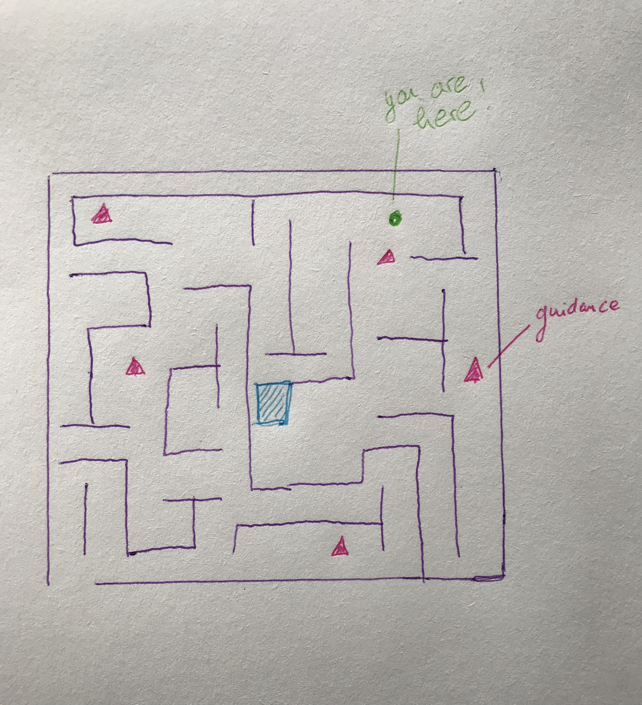

THE WAY

I came across calendar mazes structures using the sun to collect data. I also came across “Block Universe Theory” with a “everything is already written” determinism and scientists saying you can only make sens of time through change. One could think of a maze-calendar with indications coming not from the sun but from things or persons of the present, past or future to help (kind of NPCs) to find the way. I will collect data through interviews to understand what or who people would chose for guidance.

