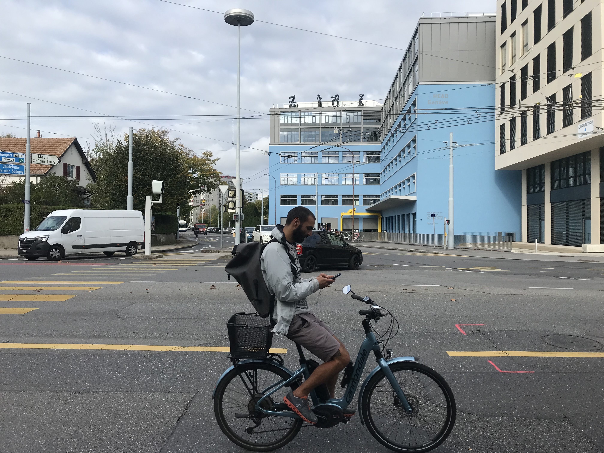

Who would have thought ?

Watching the sequence below highlights the idea of being able to rewind a seemingly immobile element and moving it forward in time as well. Consequently, discovering a hidden or unexpected environment either unwrapping around this element or integrating it into its bounds. The static image isn’t only a point in the timeline, but also a point in time used to locate this scene in a broader temporality. By this, giving the immobile element its own narrative that could be also a piece from a larger one.

