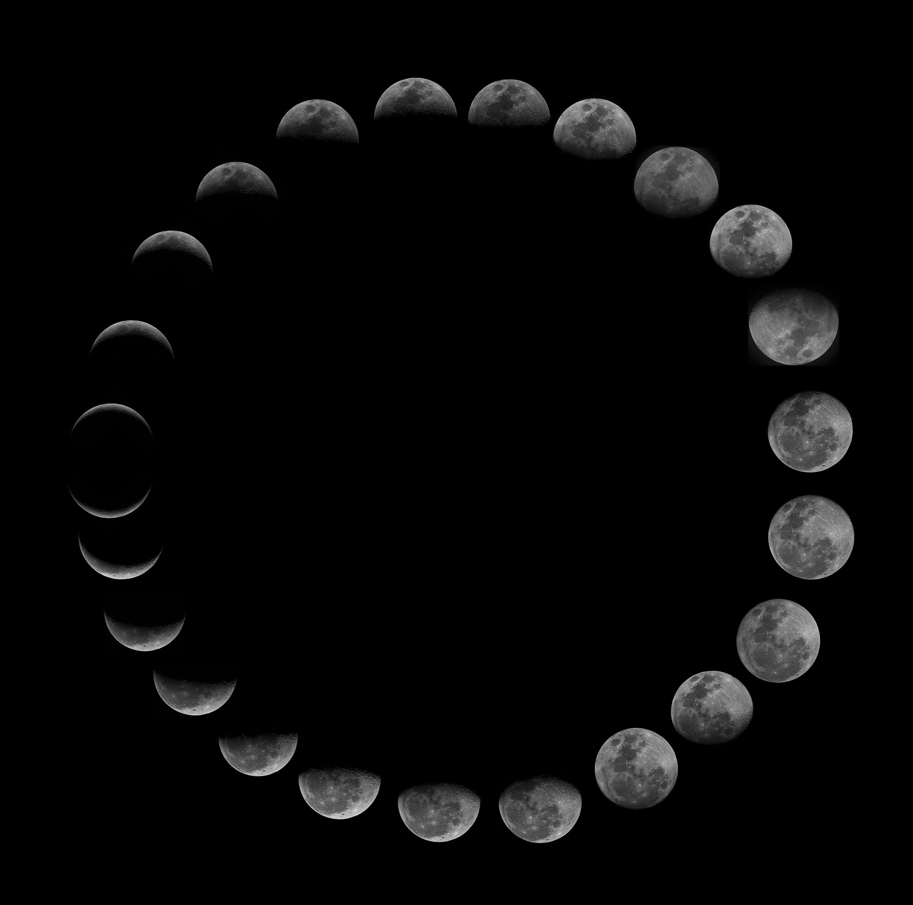

The Keys

You go through different worlds all intertwined. In each world you find an afrtefact you'll use to get to the next world. All this in the hope of finding your keys. I rewordked my worlds, gave them more depth and details. Each world has its own temporality and characteristics. Today's twine type is a gauntlet because I want a solid base before I build different paths and create agency. The story will be a retroactive narration in which you'll find out that the character simple itention is in fact deeper. Allowing different ends to unwrap themselves according to the path you chose. Still have to write those parts.

