# Listening 

## Podacts & documentaries about time perception
### JRE #1233 
(https://www.youtube.com/watch?v=wieRZoJSVtw)
### TED-Ed "Does time exists?"
(https://www.youtube.com/watch?v=R3tbVHlsKhs)
### Big think "Time: Do the past, present and future exist all at once ?"
(https://www.youtube.com/watch?v=5vzymaIabWI)

## Useful infos : 
Illusion of time, Order to Disorder, complexity emerging briefly from decay, Past/Present/Future happening all at once : you are dead trillions of years ago yet you aren't even born yet. Time as a Tide or a Movie in the emergent property theory.

## Theory of relativity
(TED-Ed, 0:58) Albert Einstein theory of relativity states that time passes for everyone 
but not at the same rate for people in different situations. For instance if you travel at the speed of light : time slowes (Big Think, 8:04).

Space-Time as a single "thing", a four dimensional bloc in which the past and the future are just like spatial diemnsions (like North/South) in the equations of phsysics (Big Think, 2:00). You can construct a view of the world where the future is already there. In the fundamental laws of physics, physicists do say that there is no distinction between the past and future and even though it is in conflict with our intuitions about the world, from that perspective, time is not an independent element but rather another dimension, like sapce. There is a big question that isn't resovled yet tho : How is it that we can move in space in all any direction but through time in only one ? The past is always behind us --> arrow of time (TED-Ed, 1:38)

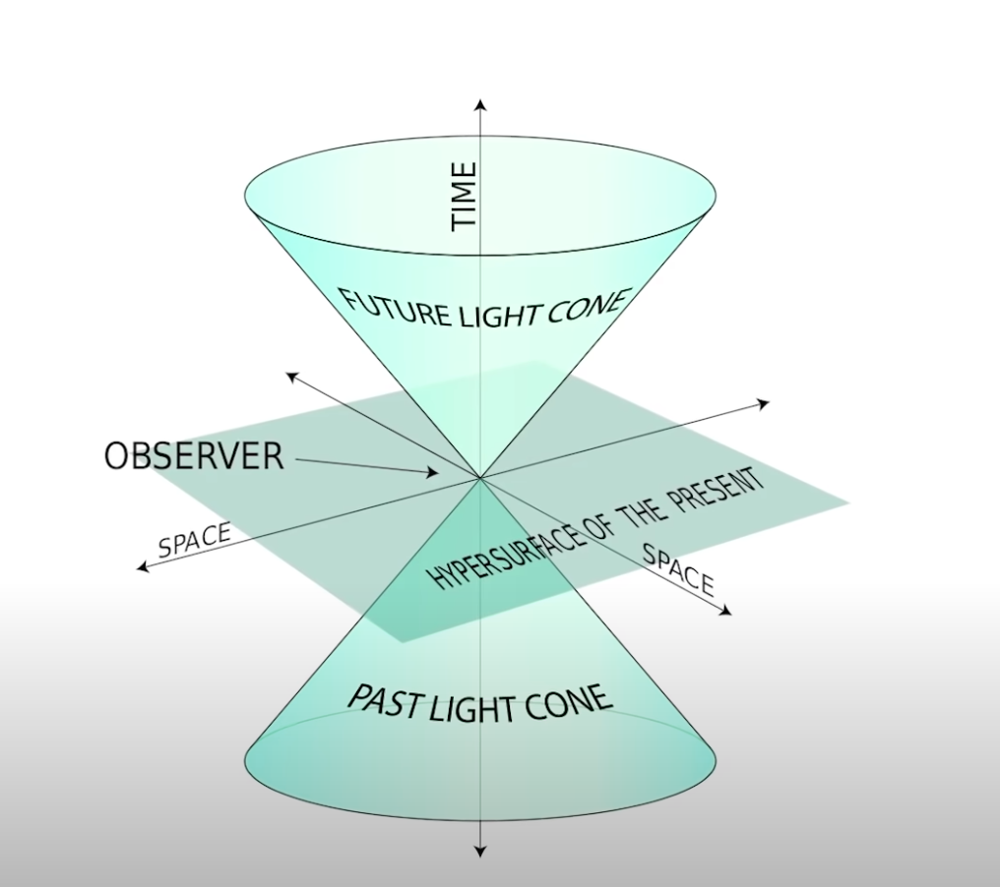

## The second law of thermodynamics
Basic common sense thing that things go to s*#@ (JRE Brian Cox, 1:29:52).
Systems will gain disorder over time --> exemple of the food coloring spreading in the cub of water and not recollecting. Systems in our universe move from order to disorder and it is this property of the universe that defines the direction of the times arrow (TED-Ed, 2:20).

"What we strongly suspect, And I would say "no", is that in that process going from order to disorder, complexity emerges naturally for a brief period of time. So, it is a natural part of the evolution of the universe that you get a period in time when there's complexity in the universe. So, stars, planets, galaxies, life and civilization. BUT they exist BECAUSE the universe is decaying and not IN SPITE of the fact the universe is decaying. So, our existence in that sort of picture is necessary finite and necessary time limited. And, it is a remarkable thing that that complexity has gone so far that there "are" things in the universe that can think, feel, and explore it. If you want an answer to the meaning of it all, it's that." (JRE Brian Cox,1:30)

## Time as an emergent property
As a thought experiment : ff a time-starved equation like the Wheeler Dewitt's one (Theory of Everything, speculative) turned out to be true, would that mean that time does not exist at the most fundamental level ? Coud time be an illusion generated by the limitations us humans percieve the universe ? We do not yet know. But instead of asking if time exists as a fundamental property, we could think of its existence as an emergent one.

Emergent properties are things that don't exist in individual pieces of a system but do exist for the system as a whole : each individual water molecul doesn't have a tide but the whole ocean does. A movie creates change through time by using a series of still images that appear to have a fluid continuious change between them. Flipping through the images fast enough, our brain percieves the passage of time from the sequence of still images. No indivudal frame of the movie changes or contains the passage of time but it's a property that comes out from how to pieces are strung together. The movement is real, yet also an illusion. Could the physics of time somehow be a similar illusion ? (TED-Ed,3:28)

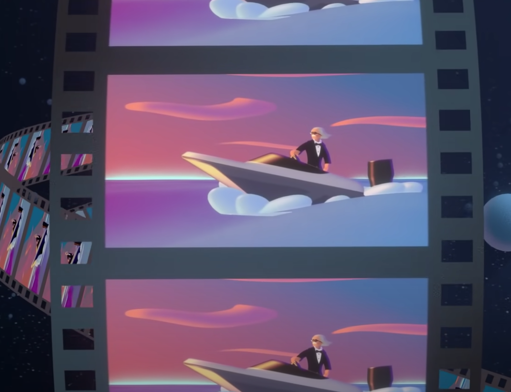

# Photography

## Before-After
I took pictures of some of my training partners before the training and after the training to observe the change in their portraits and in mine (they took one of myself aswell), through the passage of time and during a physicall effort.

# Calendar

## Biblio
https://notesofnomads.com/japanese-date-system/
https://www.nihu.jp/en/publication/nihu_magazine/028#:~:text=A%20Japanese%20era%20name%20is,mark%20the%20passage%20of%20time.
https://en.wikipedia.org/wiki/Japanese_era_name

## intro 
While watching anime last night, there was a scene where a kid was talking about his deceased brother. At one point he said that he died "Meiji Year 27, September 17th". I wondered what it meant and decided to investigate.

## Explaination
First of all, today's year is 2022 right ? well for the japanese we are actually in the Reiwa era year 4 or 'R4'. While Japan adopted the gregorian calendar in the 19th century, this system of designating years as era names based on he reign of the emperors is still a current practice and runs along the gregorian calendar we are used to. A ?'gengō' or era name is starts the day an emperor/empress ascends to the throne and ends the day he/she dies. The era names are chosen by court officials and aren't based on the empereor/empress names.

## Outputs
These observations on the nature of japanese era names and its calendar system highlighted the fact that there are numerous different calendars in the world based on lunar, solar and sometines both cycles. It could be interesting to investigate it more to understand the diffferences and how different ancient civilizations or modern era cultures relate to time fragmentations.

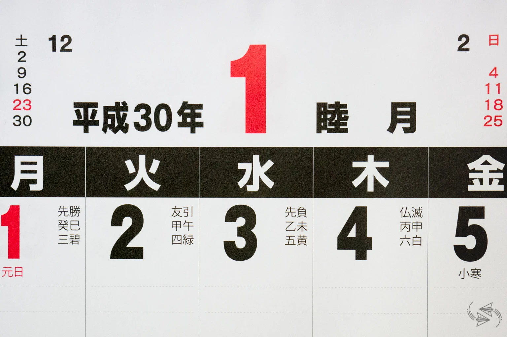

# Compiling 

In this next part of my observations, I started going from the idea that past, present and futur happens al simultaniously on a quantum level (special theory of relativity). From there I found an article on the block universe theory from which I took some elements that resonated with me. Regarding the calendars topic, I wanted to find a multi temporal calendar and edend up reading essay/article on the gnomon labyrinths one can find in england and russia. From there I started to get interest in the very definition of what a labyrinth is and make sens of these new informations and merge them.

## "Block Universe theory : Flow of Time" by (Alper Çakır,2020)
"The block universe theory which is supported by special relativity, claims time isn’t the thing that we experience. According to theory, our universe is a block that contains everything in anywhere and anytime. In this context, past, present, and future are all real at the same time. There are no differences between them. Time behaves just like space in this theory, every moment has its own coordinate at the space-time continuum — the end and the beginning happen at the same time."

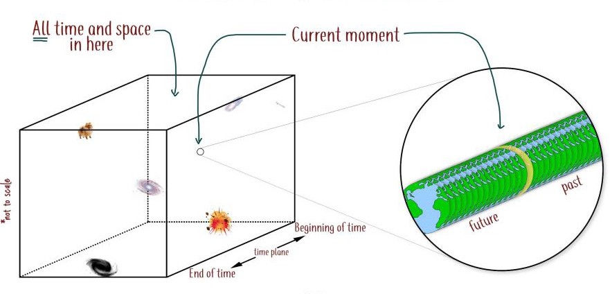

(...)"To facilitate narration, let’s visualize the block model of the universe with a prism. Here, height and width represent the space dimensions of the universe, and the length of the prism is the expression of time. One corner shows the big bang, the beginning of the time, and the other corner shows the end of the universe and time. This represented prism of block universe is filled with all the events that lived and will be lived. Events are found as coordinate points in the prism, all of them exist somewhere in the space-time continuum."

"Time, from our perspective, flows in the form of yesterday, today, and tomorrow. However, according to the theory of the block universe, it is impossible to talk about a specific present time, it is relative to the past and the future. In other words, there is no flow of time. The truth is only in the form of a reflection of the event in that person’s mind. British physicist Julian Barbour describes the time as follows: “Successive images that constantly change together are successive photographs. I’m looking at you, you’re shaking your head. Without this change, we would not have the concept of time.” According to the Barbour, the truth is not the time, but change. Time only exists as a reflection of change.

When we think of time as one of the other dimensions of space, we get a more understandable perspective. From this point of view, talking about the present time is a point that is equivalent to saying, “I’m here.” (...)"

The "I'm here" coordonate on the prisme made me think of the "You are here" on maps or at the beginning of the map of labyrith maybe ?

The passage about Julian Barbour on change being the sole element that could make sens of time made me rethink of my previous observation with the "before-after" pics at my BJJ academy and the concept of "Time as an emergent property". I will later explain how I think it is mergeable with the labyrinth gnomon concept.

## Gnomon of Solar Hours Calendars—The Ancient Instrument of Orientation in Space-Time, a Key of a Labyrinth and a Basis of Modeling of the World (Alina Paranina, Roman Paranina, 2016) 

"The proposed concept of a labyrinth-gnomon—an orientation tool in space and time– conveys possible usage of a bispiral labyrinth as a sundial, compass and calendar. The shadow of the vertically adjusted object in the centre—a gnomon (from Greek—indicator) reflects the daily and annual movement of the Sun. Aggregate daily shadow has the shape of the fork and reminds horns or wings. Calendar changes in the geometry of shadows conform to the structure of the figure of the
 abyrinth and can be used to refer to the seasons: the first from the center of the arc corresponds to the short shadows of the summer solstice (next to it are the shadows all the summer months, which is consistent with the title this season in many European languages) The second arc corresponds to the equinoxes (separating the two main seasons, the first of which—the summer, and the second—winter), the last, eleventh arc corresponds to a time, close to the winter solstice. Twelfth of the arc at a latitude close to the Arctic Circle was not used, because noon shadow in the days of the winter solstice was far removed from the center of the labyrinth, for its observation is more suitable vertical screen of the stones - the northern addition (Fig. 6, В). In more southern regions where winter sun does not descend so low, and shadow is shorter, the
extreme edge corresponds to the winter solstice, and the total number of arcs 12 and 7—in the classical forms of rational five arcs can be used twice."

In my own understanding what can be taken from a labyrinth-gnomon is that its structure is made in a way that the shadow on the rocks coming from the sun's light gives indications in a form of calendar.

## Key Insights

The definition of a labyrinth is " a complicated irregular network of passages or pathsin which it is difficult to find one's path". A labyrinth-gnomon is influenced by the sun. The block universe theory can be represented as a prism which its height is the dimensions of space and its length is it's time (B->E) where past, present and future happends all at the same time because you present time is merely a coordinate on the prism (I am here) and Julian Barbour describes time as a successive images that constantly changes.

The definition of a labyrinth made me think of an allegory/metaphore of life. Sometimes you are lost in the flow of your life and you'd wish that somebody or something would give you a tip to help give guidance on your life. One could also argue that if everything is already "written" in the sense of the block universe theory, it still feels good to be reassured regarding one's path directions. Following those takes on the previous insights, in the form of labyrinth-gnomon which displays information thanks to the sun's light and the shadow it creats on rocks, another type of labyrinth-calendar could get its informations from time as an emergent property with before-after (past-futur) elements regarding the main character. Those elements would give indications to navigate through the labyrinth (Life).

To know about those B-A elements interviews should be conducted.

# New Observations for the 02 of nov

## pictures : before-after, long exposures, iPhone lives, timelapses and control images

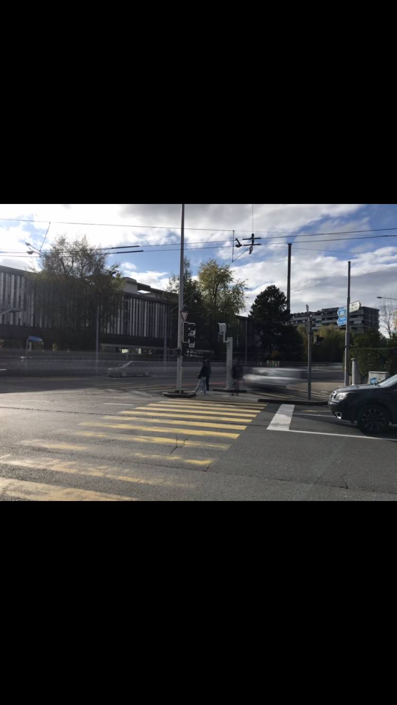
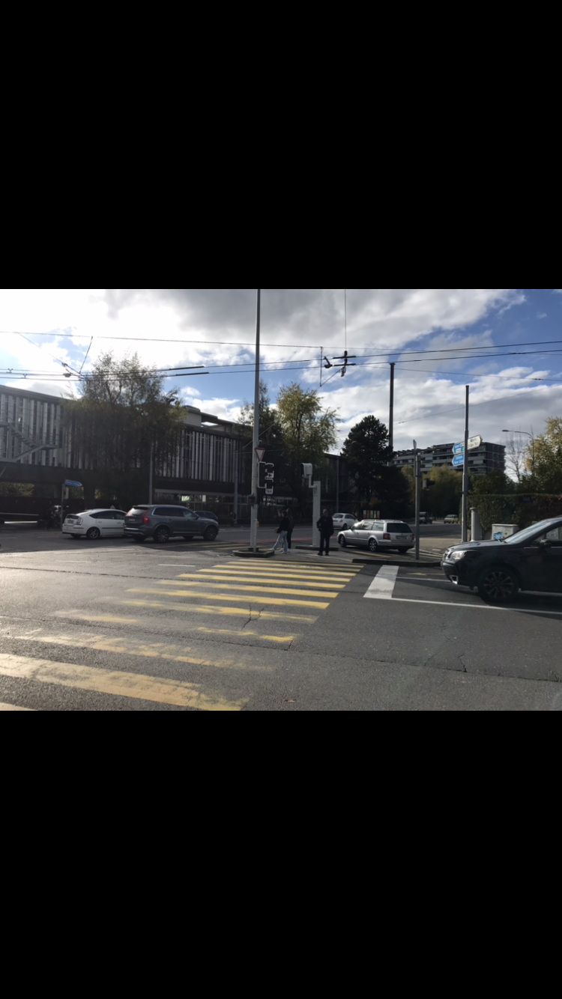
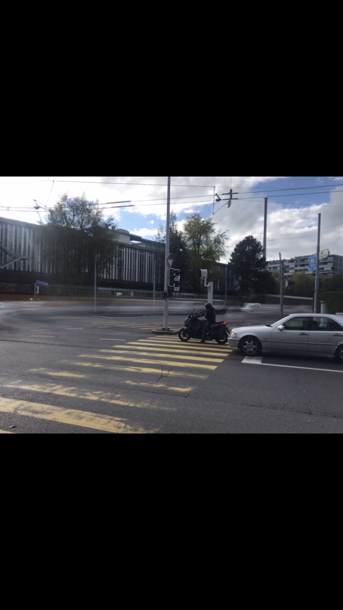
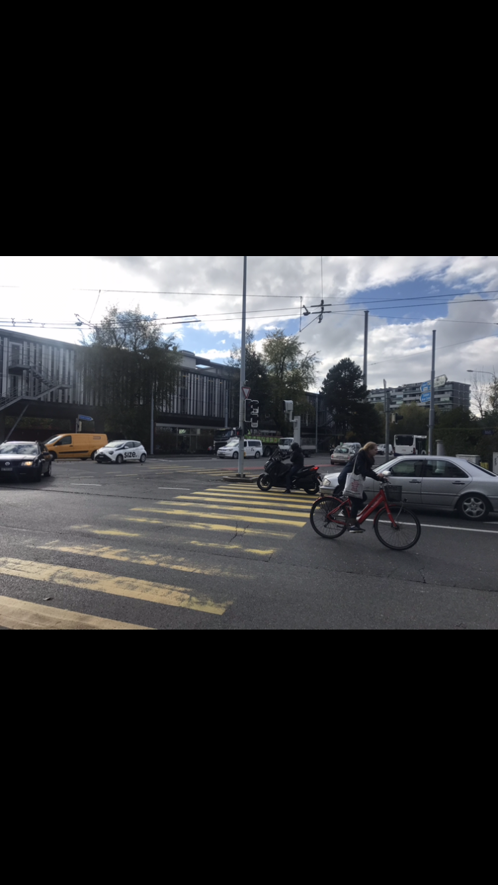

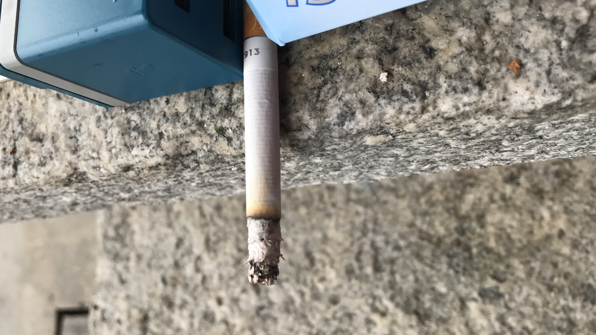

# Interview

Questions interview

*shows static picture* 

1)Describe me what you see in this picture ? 

*shows long exposure picture*

2)And here ?

3)What is different from the one before ?
 
4)In your own words explain me what could suggest that time is passing in this picture ?

*Shows timelapse*

5)What about here ?

*Shows cigarette burning pic*

6)Would you tell time is passing here as well ?

7)In what is it different from the timelapse ?

Subject 1

1)	Un Cycle de déplacement des véhicules. Et un espace entre eux, il et similaire.

2)	Je vois précisément la fusion entre ces espaces mais en une seule ligne, comme si ils avaient fusionnés.

3)	La différence est qu’on ne peut plus distinguer les éléments, ils sont mélangés, fusionnés. Quand je dis éléments je parle des véhicules.

4)	Les traces, la distorsion. Il y a une part de l’image qui n’est pas statique.

5)	Je sens qu’il y a une usure et une dégradation de l’élément. Quand il se consume, il disparaît. Ca peut s’associer à des étapes pour les gens et symbologie très forte derrière la cigarette comme un élément que se consume. Ca représente la réalité de tous, on nait on se reproduit, on meurt.

6)	Oui, depuis l’analyse des signes j’y vois une action (dans l’image) pour y voir le temps il n’est pas nécessaire qu’il y ait du mouvement. Je vois une scène et non quelque chose de statique. Il y a aussi de l’incertitude car je ne sais pas si elle va se consumer complétement ou non.

7)	Au niveau du temps c’est presque la même chose, seul al frome de représentation (une image et une vidéo). La vidéo se rapproche plus de nous car on voit tout en animé (perspective humaine) mais le message est le même.

Subject 2

1)	Je vois un milieu urbain un flux de navigation de voiture, moto, cycliste, passage piéton pour traverser. En arrière-plan de la végétation. Les trottoirs qui longent les bâtiments. On a aussi quelques panneaux de signalisation et toute une infrastructure qui permet aux bus de se déplacer.

2)	J’ai l’impression qu’elle est plus vide d’interaction humaine, moins de circulation. Comme si la prise de vue était plus floue ou diffuse. Comme si le temps s’était fondu 

3)	Elle (la 2ème) a l’air plus calme, statique, figée.

4)	D’une part on a la luminosité ambiante du ciel en fonction des déplacement des nuages on peut voir que le temps passe de manière normale, flou de trajectoire des voitures qui naviguent en arrière-plan, puis la moto et voiture en premier plan qui attendent avant de partir, puis pour piéton il y a une sort d’attente , de marqueur du temps du temps a attendre pour traverser la rue 

5)	Le temps que  la cig prend à être consumée le mouvement de la fumée indépendamment de la cig, c’est un maruqeur du temps qui avance. On sent que la vidéo est plus accéléré, on sent les vibrations de la pers qui tient la caméra, temps pas échelle 1 :1 mais plus accélérée, lumière ambiante -> jour

6)	Bcp moins, on sait qu’il y a une action mais vu que la fumée est figée est que c’est une image on a aucune indication de savoir si la cig est éteinte ou si elle est allumée et qu’elle continue de se consumer, il y a moins de marqueurs.  Luminosité  jour Ca donne un moment entre 8h et 17h entre cette période de temps. Si la cig est éteinte, il y a moins de marqueurs

7)	On a moins de marqueurs de temps tout simplement. On pourrait interpréter du coup bcp plus de chose face a une image statique. Dans une vidéo y’a une fin et un début et les choses sont plus posées dans le temps

Subject 3

1)	C’est l’intersection devant l’école avec des vélos et des voitures et un camion jaune.

2)	Même intersection mais on peut pas voir les voiture des de manière distincte, comme si elles allaient trop vite.

3)	Les voitures de la voie principale disparaissent.

4)	C’est une exposition longue  donc on peut imaginer que c’est les voitures qui vont hyper vite et qu’on a pas le temps de les voir

5)	La combustion de la clope

6)	Oui, on devine qu’elle va pas rester comme ça et qu’elle va continuer a brûler.

7)	L’animation, le fait que ça bouge.

Subject 4

1)	Je vois des véhicules, un carrefour proche de l’école, les nuages c’est peut-être aujourd’hui. On voit certains véhicules immobiles et d’autre qui bougent.

2)	Il y a aussi des véhicules, on voit que c’est pas la même façon de prendre la photo, plus d’exposition donc on voit mieux les véhicules en mouvement

3)	L’exposition. Les véhicules immobiles sont effectivement immobiles. Ca confirme ce que je pensais 

4)	 le mouvement et le fait que ça soit une longue exposition

5)	La clope qui se consume c’est le plus évident plus les gouttes de pluies qui se rajoutent sur les surfaces, et le simple fait que ce soit une vidéo c’est un marqueur de temps qui passe, ca passe dans le bon sens (pas a l’envers).

6)	J’ai envie de dire que oui car on voit les cendres par terre on a la sensation que la cig brule car on devine de la fumée. Un truc qui se consume c’est une grosse image du temps qui passe que ce soit une cig ou une bougie.

7)	L’image est statique.

Subject 5

1)Des vélos, des voitures, une route

2) Moins de voiture et moins de motos.

3)la quantité de passage

4) la couleur du ciel. Pcq ca change en fonction du soleil et la lumière

5) les gouttes de pluie qui tombent sur la cig et sèchent ensuite.

6) il y a qqch qui se consume donc ça requiert du temps car ça a une dynamique et c’est ps un état statique.

7)Elles m’évoquent la même chose. Si je me concentre que sur la cig c’est que je connais le processus de consumation d’une cig même quand l’image est fixe je vois le mouvement que ça crée

Subject 6

1)	Un passage piéton des voitures des vélos qui passent

2)	Pareil un passage avec une moto et une voiture. Elles ont l’air d’être à l’arrêt alors que les autres étaient en mouvement (plus de mouvement). Les voitures sont en mouvement on voit leurs traces de passage.

3)	Celle d’avant j’ai l’impression que les voitures sont à l’arrêt et celle d’après je vois un flux de mouvement. La première paraît bcp plus figée que la 2 -ème

4)	Comme si le paysage ou les objets avaient été étirés

5)	L’accéléré d’un objet qui disparaît. Le fait qu’il change d’apparence. Et pour changer d’apparence il a besoin de temps.

6)	Non car c’est un instant figé, ca pourrait très bien être a une heure comme a une autre rien n’indique un changement de temps. C’est surtout lié au fait que la photo est figée.

7)	La photo est figée et la vidéo est en mouvement. Vidéo temps passe, photo moment précis qui pourrait être n’importe quand dans la journée. On voit pas sur la photo que l’objet peut évoluer.

Subject 7

1)	Je vois une route je peux reconnaître la head derrière, je comprends pas qui est vert ou rouge (pour passer) peut être du sens opposé car je vois une voiture que j’imagine qui va venir vers moi.

2)	Je vois une trace que je suppose qui est la voiture d’avant qui est passée selon la trajectoire imposée par le croisement des routes. J’arrive pas exactement distinguée quelle voiture c’est, je vois une trajectoire définie. Les deux arrêtées au feu rouge sont toujours là car je constate qu’elles ont pas bouger sinon j’aurais vu la trace.

3)	Du coup le vélo a disparu et je pense qu’il est allé dans le direction de la trace car dans le sens logique de son déplacement c’est sa trajectoire. Tu sais comment une chose marche et tu imagines sa suite logique.

4)	Clairement la trace de la voiture en mouvement ca te montre le passage du temps pcq tu peux voir un décalage de l’état de la voiture.

5)	Déjà c’est une vidéo et donc je sais que le temps passe. Le fait de connaître comment marche une cigarette ca me dit que cette vidéo n’est pas tournée en arrière car je sais qu’une cig se consume comme ca. Si elle était au contraire que la cig ce reconstruit je pourrais. Je sais qu’un objet a un état initial et je sais que si on la brule quelle est son résultat final. Quand elle est brulée elle ne peut pas retourner a son temps initial et tu ne peux pas reconstruire la cig car physiquement ce n’est pas possible.

6)	Non car je ne peux pas faire une comparaison. Dans le sens que sans l’avant et l’après je ne peux pas te dire si dans cet instant la si la cig est allumée ou pas. Ca me laisse un peu hésitante.

7)	Avant j’étais certaine que la cig brulait car j’avais des preuves et la justement ca pourrait être une photo dune clope éteinte artistique mais je ne connais pas son état elle est au milieu de qqch mais est ce quelle arrêtée ou il y a une continuité

Subject 8 

1)le fait que la cigarette brûle et qu’elle se raccourcie et se transforme en cendre. D’abord elle est séche sur le papier,uis on voit des goutes, puis elle sèche à nouveau.

2-3) vu que c’était un timelapse le temps avancait plus vite, là vu que c’est figé c’est plus dure de l’inscrire dans une temporalité même si je peux dire que la clope brûle. On ne sait pas trop ce qui se passe avant et après.

Subject 9

1)L’évolution de la cigarette, le fait qu’elle soit consumée. Le fait qu’il y ait du mouvement.

2) Non, c’est un marqueur temporel d’un instant mais que le temps ne s’écoule pas.

3) la différence d’état entre le début et la fin. Le mouvement, qui implique le temps et l’espace. Il n’y a pas de mouvement dans l’espace sans écoulement du temps.

Pitch photo static clope 3 temporalities :

Présent figée dans le temps
Présent-continuité(futur)
Passé-présent-futur

Monde : tout est figé quand on s’approche d’un objet on voit sa temporalité (je ne sais pas encore laquelle).

Cigarette exemple parlant car pour certains l’image figée ne représente que le présent et on ne peut pas deviner la continuité (est elle éteinte ?), ni son passé (quand a t’elle été allumée ? est ce que c’est une vraie qui brûle vraiment ? pour d’autres elle on peut facilement la placé dans une continuité (suite logique, elle va continuer de consumer), pour d’autres on y voit clairement un début quand elle a été allumée, un point T qui est le présent (la photo), et une fin (suite logique, elle va brûler).

/////

Mots pour définir le scope par rapport à la vidéo du vélo :

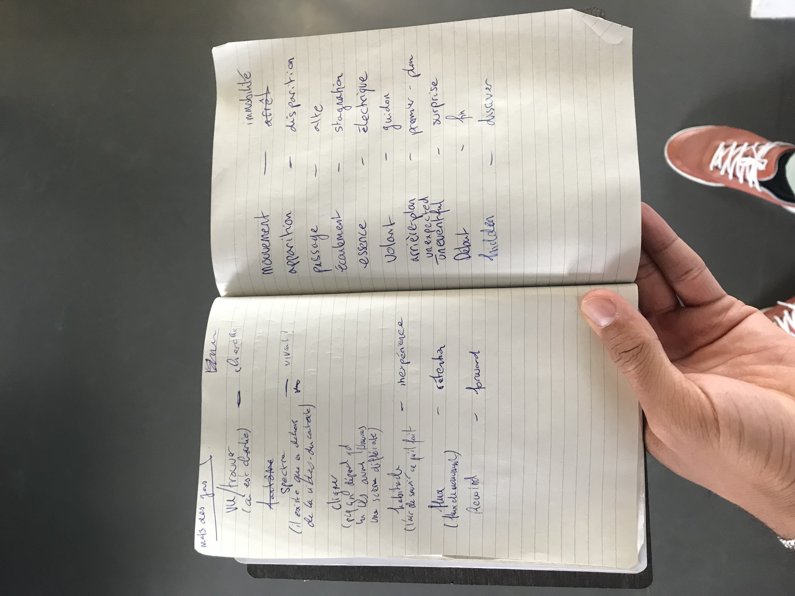

/////

Regarding the worlds:

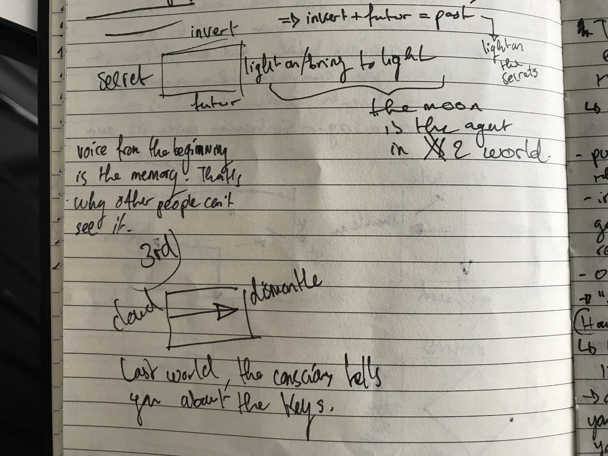
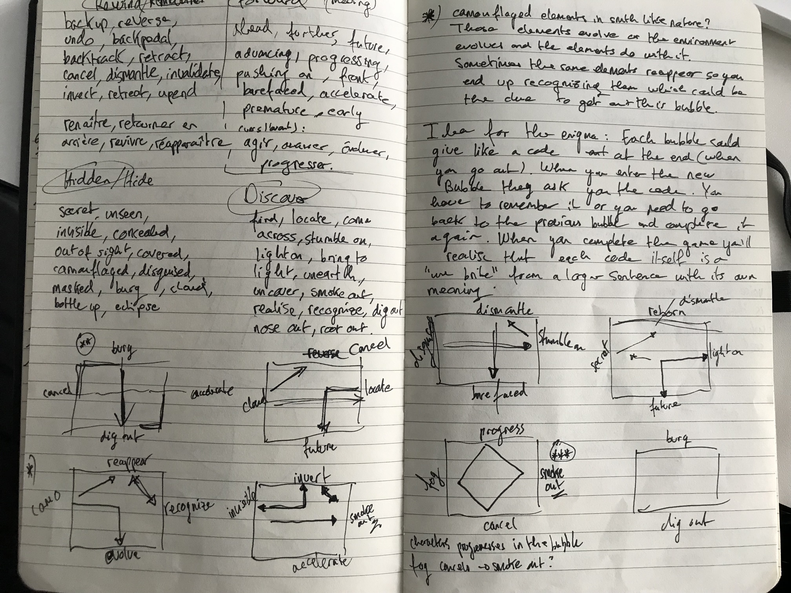

I ended up choosing 3 worlds : 

1) Camo - evolve - reappear - recognize
2) Secret - invert - futur - light on
3) Cloud - dismantle

I want to have a retroactive narration where you understand at the end that the story isn't about amnesia but about different temporalities.

/////

After my tutorial of the 28th of november, I was asked to rewrite my worlds and give the more details. That's what I did. I also switched the secret world fror the moon world :

Cloud World

Le monde des nuages est paisible. Il y fait tempéré et on s’y sent bien. On y entre par trappe qui vient du monde de la lune. La trappe donne sur des escaliers. Une fois descendus, on entre dans le monde des nuages. En s’y promenant, on remarque que le sol est moelleux tel un matelas, blanc comme de la porcelaine et doux comme une étreinte. Les pieds s’y enfoncent légèrement à chaque pas, ce qui rappelle la sensation d’une marche d’hiver dans champ couvert de neige. Pourtant la matière n’est pas froide ou humide, seulement puffy. 

Ce monde semble être composé d’un grand nombre de nuages aux formes irrégulières, collés les uns aux autres. Il n’y a pas de murs a proprement parlé mais lorsqu’on regarde vers le ciel on remarque qu’on est entourés de sortes de parois composées de courbes. Elles paraissent fermes, néanmoins, lorsqu’on y plonge les mains elles sont en réalité onctueuses comme une mousse. 

L’horizon est vaste et s’étend à perte de vue à la manière d’une prise de vue par le hublot d’un avion. On pourrait s’y sentir perdu ou anxieux face à une telle immensité. Toutefois, l’environnement n’est pas hostile et la quiétude qui en découle permet de se sentir tout d’abord apaisé, avant de laisser place à la plénitude. 

Bien que les nuages soient denses, des rayons de soleil se glissent dans leurs courbes, ce qui produit des reflets orangées. Quelques trous permettent de percevoir le bleu du ciel. Il n’y a pas d’odeur particulière qui se dégage, toutefois on dit que les nuages ont le goût de barbe à papa, en moins sucré. Par ailleurs, ces derniers ne sont pas les seuls à être suspendus, le temps y est aussi. Son passage semble arrêté car les rayons du soleil ne semblent jamais s’estomper ou se déplacer, il restent immobiles. Piégé dans un éternel présent, il te faut utiliser les artefacts récoltés dans les autres mondes pour pouvoir sortir. Donc la poussière de lune 

Moon World

Bien que la beauté soit subjective, le monde de la lune subjugue quiconque s’y aventure. Il y fait frais, pourtant on s’y sent à l’aise. On y entre par une porte spéciale au pied de l’arbre lunaire qui se trouve dans la forêt des changements. C’est une porte à verrou traditionnelle qui nécessite qu’on tourne une clé dans une serrure. Une fois entré dans le monde de la lune on remarque que le sol est rocailleux et poussiéreux. En se baladant, il est possible de rencontrer des cratères de toutes tailles, certains si gigantesques, qu’il est impossible de les mesurer à l’œil nu. D’autres bien plus petits, de la taille d’une balle de tennis. D’ici, l’entièreté de la terre peut être contemplée, ce qui confère un fort sentiment d’appartenance à la race humaine et à la Terre en général. 

Autour de la lune : L’espace, si hostile et ténébreux. Ce néant qui angoisse, ça ne donne pas envie de s’y aventurer. Le monde lunaire reste illuminé, on s’y sent en sécurité, éclairé par le soleil. La poussière de lune qui recouvre l’entièreté de ce monde est translucide, couleur os, aux traits légèrement jaunes pâle. On n’arrive pas à réellement savoir si on se trouve sur un globe ou une plaine car l’horizon est vaste. 

On sait que le temps passe car la largeur du sol qui s’étendait également à perte de vue se noie soudainement petit à petit dans la pénombre avant de revenir à son entièreté, il s’agit du cycle lunaire. Pour sortir de ce monde il faut s’aider de l’artefact (échelle ?) trouvé dans la forêt des changements, ce qui révèle la trappe (ou aide à descendre de puis la trappe).

Changing Forest

En sortant chercher ses clés, le personnage principal retourne dans le train qu’il aurait pris pour rentrer à la maison ce soir-là. Au terminus : « forêt changeante », il faut presser sur le bouton gris entouré d’un néon vert pour que la porte automatique et coulissante du train s’ouvre. En descendant les marches, on remarque qu’on se trouve au milieu d’un forêt si dense, qu’on s’y sent perdu dès les premières secondes. Les arbres sont si grands qu’on pourrait les confondre avec des gratte-ciels. 

Il y fait chaud et humide, le soleil ne peut pas entrer à cause de la végétation si étendue. L’endroit est bruyant. Un cafarnaum de bruits se fait entendre. En tendnat l’oreille on entend des slithering et des coups d’ailes. Des grognement étranges se font également entendre. Le sol est jonché de racines, des feuilles, d’insectes. 

Un sentiment de vulnérabilité se fait très vite ressentir, faisant place petit à petit à la peur. On s’y sent angoissé et mal à l’aise. De plus, la forêt est dynamique. Les branches des arbres bougent mais on ne sent pas de vent ce qui est troublant. En regardant de plus prêt on se rend compte que ce ne sont pas les arbres ni leurs branches qui bougent mais les troncs. Ils changent de formes, de taille et de couleur tel un cauchemar psychadélique. Une échelle (artefact)est appuyée contre un arbre dont le tronc ne semble pas bouger.

