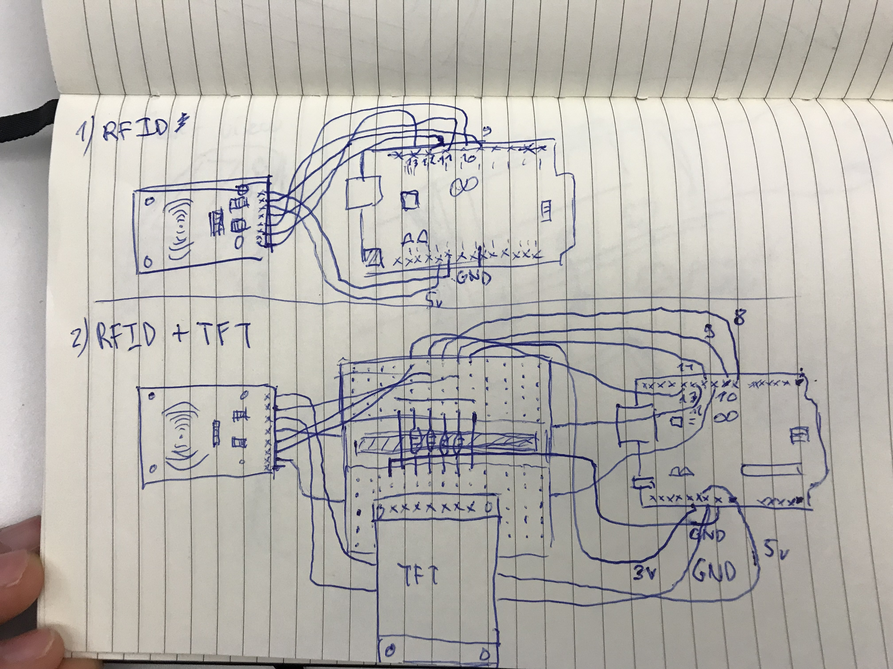
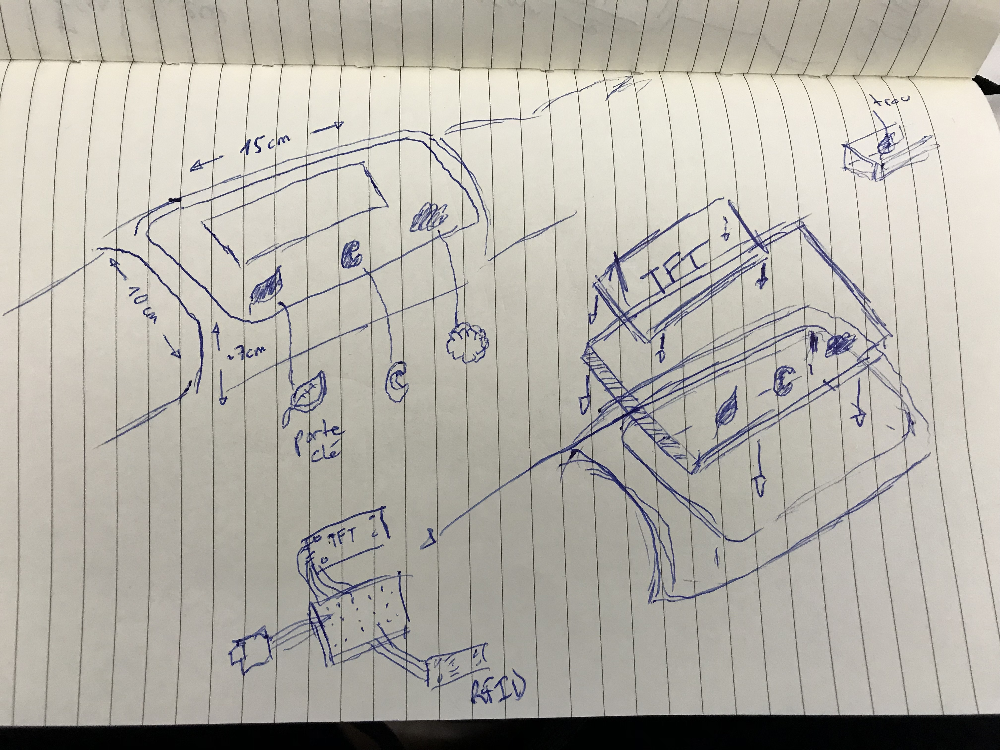

Where is it worn? On the forearm.

How is it worn? As a sleeve.

How do you interact with it? With accessories you clip and (input) and with a tft lcd screen (output).

What proportions and dimensions would you like it to have (ideal size in mm)? 12-15cm width – 10cm height.

What shape should it take? Rectangular on the top.

Which materials would you like to use? Silicon for the armband, plastic for the case and accessories.

